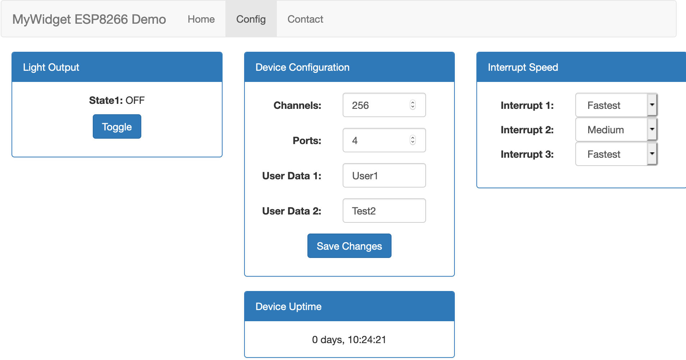

# ESP8266-MyWidget

This project can be used as a framework, learning tool or as a template for starting a new ESP8266 project.
It contains many of the components to build a ESP8266 project with dynamic web interface.

This project includes:

- ESP8266 Development
- mDNS - multicast DNS (mywidget.local)
- Asynchronous Web Server (ESPAsyncWebServer)
- Asynchronous Web Services (ESPAsyncWebServer)
- Asynchronous MQTT (PangolinMQTT)
- LittleFS File System
- Embedded Bootstrap (3.4.1)
- Embedded jquery (3.5.1)
- Save/Load Config File (text)
- OTA (Over the Air) Updates
- HTTP API Supports HTTP GET/POST
- Auto Updating Web Site (Web Services using JS)
- Multiple Interrupt Timers (ESP8266TimerInterrupt)
- Flash Onboard LED Using Interrupt Timer
- Plus much more...

## History

I purchased several [ESPixelSticks](https://www.amazon.com/dp/B072XT1V77/ref=cm_sw_em_r_mt_dp_-RscGb7XH5PQ3) from Amazon for my synchronized LED Christmas light display. After using the ESPixelSticks, I became interested in how the ESP8266 worked and how to program it. So I began to review the [ESPixelStick](https://github.com/forkineye/ESPixelStick) source code and the specifications of the ESP8266. It didn't take long to find out there is an add-on for the Arduino IDE that allows you to program the ESP8266 using the Arduino IDE and its programming language. A few years back, I had created some simple projects using Arduino UNO R3 and programmed using the Arduino IDE. Since I was already familiar with the Arduino IDE, I started by modifying some of the simple examples and playing with different libraries. I wasn't very interested in the low level hardware or interfacing to a sensor/module but I was more interested in an interactive UI and different ways to communicate with this device. I didn't have a particular project in mind so I created ESP8266-MyWidget; A project template for ESP8266.

ESP8266-MyWidget can be used as a learning tool or as a template for starting a new ESP8266 project. I tried to incorporate many APIs that may be useful for a ESP8266 project with a web interface.

## Requirements

ESP8266-based development board - I used the Wemos D1 Mini

Along with the Arduino IDE, you'll need the following software to build this project:

- [Adruino for ESP8266](https://github.com/esp8266/Arduino) - Arduino core for ESP8266
- [Arduino ESP8266 LittleFS Filesystem Uploader](https://github.com/esp8266/arduino-esp8266fs-plugin) - Arduino plugin for uploading files to LittleFS

The following libraries are required:

Extract the folder in each of these zip files and place it in the "library" folder under your arduino environment

- [ESPAsyncTCP](https://github.com/me-no-dev/ESPAsyncTCP) - Asynchronous TCP Library
- [ESPAsyncWebServer](https://github.com/me-no-dev/ESPAsyncWebServer) - Asynchronous HTTP and WebSocket Server for ESP8266 Arduino
- [PangolinMQTT](https://github.com/philbowles/PangolinMQTT) - Asynchronous MQTT client library
- [ESP8266TimerInterrupt](https://github.com/khoih-prog/ESP8266TimerInterrupt) - Supports 16 ISR-based timers

## Features

---

## mDNS - multicast DNS

- Mulicast DNS allows you to use a local DNS name (mywidget.local) to access the web interface.
- There is no need to know the local IP address obtained from the WIFI connection.
- mDNS will resolve the IP address for you.

- Enter the following into browser ``http://mywidget.local``

## Web Services

- Asynchronous
- Supports GET and SET ACTIONS
  - Formats:
    - cmd:get:action
      - cmd:set:action
    - All requests and responses are in TEXT format.

  - GET ACTIONS

  - Uptime - Returns device uptime in milliseconds.
  - Request: ''cmd:get:uptime''
  - Response: ''cmd:get:uptime:NNNNNNNN''
    - where NNNNNNNN is the device uptime in milliseconds

  - Status - Returns status of light (0/1)
    - Request: ''cmd:get:status''
    - Response: ''cmd:get:status:N''
      - where N is "0" or "1" representing "OFF" or "ON" of light

  - Speed - Returns flash speed of onboard LED
    - Request: ''cmd:get:speed''
    - Response: ''cmd:get:speed:N''
      - where N is "1" to "4" representing flash speed of onboard LED

  - Config - Returns current configuration parameters. Read from /cfg.txt file.
    - Request: ''cmd:get:config''
    - Response: ''cmd:get:config:channels:ports:user1:user2''
      - where channels is NNN, ports is NN, user1 is XXXXX, user2 is XXXXXX

  - SET ACTIONS

    - Toggle - Toggles the current light from 0 to 1 or 1 to 0
      - Request: ''cmd:set:toggle''
      - Response: ''cmd:set:toggle:N''
        - where N is "0" or "1" representing "OFF" or "ON" of light

    - Speed - Sets the flash speed of onboard LED
      - Request: ''cmd:set:speed''
      - Response: ''cmd:set:speed:N''
        - where N is "1" to "4" representing flash speed of onboard LED

    - Config - Sets current configuration parameters. Saved to /cfg.txt file.
      - Request: ''cmd:set:config:config:channels:ports:user1:user2''
      - Response: ''cmd:set:config:channels:ports:user1:user2''
        - where channels is NNN, ports is NN, user1 is XXXXX, user2 is XXXXXX

## Web Server

- Asynchronous
- Supports serving html, css, js files
- Sets default to index.html
- Serves two embedded web pages (index.html & config.html)
- Supports file not found message

## User Interface

- Nav Bar Menu
- Home and Config pages implemented
- Displays Current Light Output
  - State1 field updates on page load and when the "Toggle" button is pressed
- Displays Current Device Configuration
  - Channels, ports, user1 and user2 fields update on page load
  - Channels, ports, user1 and user2 are input fields
  - Channels, ports, user1 and user2 can be modified and are saved when "Save Changes" button is pressed
- Displays Current Device Uptime
  - Uptime is updated on a 1 second basis
  - Uptime format is: "N days, HH:MM:SS"
- Displays Current LED Flash Speed
  - Select input allows onboard LED speed to be changed
  - LED speed is updated on select input change
- All messages to/from config page use Web Services
- Web Services has queue implemented if server is busy
- Implemented using embedded Bootstrap (3.4.1)
- Implemented using embedded JQuery (3.5.1)

## HTTP API - GET and POST

- Asynchronous
- HTTP GET FREE HEAP (TEXT)
  - URL: `http://mywidget.local/heap`
  - Returns free heap space
  - Request:
    - Name/Value Pair: N/A
  - Response:
    - freeHeap=[Free Heap]
  - Example Request:
    - `http://mywidget.local/heap`
  - Example Response:
    - `freeHeap=38616`

- HTTP GET INTERRUPT COUNT (TEXT)
  - URL: `http://mywidget.local/intcount + optional query string parameters`
  - Returns interrupt counter(s) based on query string parameters, if no query string parameters, then intcount1
  - Request:
    - Query String Parameters: N/A
  - Response:
    - `:intcount1=[Interrupt Counter]`
  - Example Request:
    - `http://mywidget.local/intcount`
  - Example Response:
    - `:intcount1=4533456`
  
  - Query string parameters (optional):
  - Request:
    - 1=true, 2=true, 3=true
  - Response::
    - Interrupt Counter(s) based on query string
    - Name value pairs are delimited using colon ":".
    - Name and value fields are delimited using a equal "=" sign.
  - Example Request:
    - `http://mywidget.local/intcount?1=true&2=true&3=true`
  - Example Response:
    - `:intcount1=4533456:intcount2=23236:intcount3=98434445`
    - Example Request:
    - `http://mywidget.local/intcount?3=true`
  - Example Response:
    - `:intcount3=98434445`

- HTTP GET INTERRUPT COUNT2 (TEXT)
  - URL: `http://mywidget.local/intcount2`
  - Returns interrupt counter 2 - interruptCounter2 variable
  - Request:
    - Query String Parameters: N/A
  - Response:
    - `:intcount2=[Interrupt Counter 2]`
  - Example Request:
    - `http://mywidget.local/intcount2`
  - Example Response:
    - `:intcount2=23236`

- HTTP GET INTERRUPT COUNT3 (TEXT)
  - URL: `http://mywidget.local/intcount3`
  - Returns interrupt counter 3 - interruptCounter3 variable
  - Request:
    - Query String Parameters: N/A
  - Response:
    - `:intcount3=[Interrupt Counter 3]`
  - Example Request:
    - `http://mywidget.local/intcount3`
  - Example Response:
    - `:intcount3=98434445`

- HTTP GET STATUS (TEXT)
  - URL: `http://mywidget.local/status + query string (name/value pairs)`
  - Returns status about network, filesystem, signal, heap and chip info in text format.
    - Name value pairs are delimited using colon ":".
    - Name and value fields are delimited using a equal "=" sign.

- HTTP GET SYSTEM STATUS (JSON)
  - URL: `http://mywidget.local/status-json + query string (name/value pairs)`
  - Returns status about network, filesystem, signal, heap and chip info.

  - Query string (name/value pairs) parameters:

  - Network
    - Request:
      - Name/Value Pair: network=true
    - Response::
      - ssid=[SSID]
      - hostname=[Hostname]
      - ip=[IP Address]
      - gateway=[Gateway]
      - netmask=[Netmask]
  
  - Filesystem
    - Request:
      - Name/Value Pair: fs=true
    - Response::
      - totalBytes=[Total Bytes]
      - usedBytes=[Used Bytes]

  - Signal
    - Request:
      - Name/Value Pair: signal=true
    - Response::
      - strength=[Signal Strength]

  - Heap
    - Request:
      - Name/Value Pair: heap=true
    - Response::
      - freeHeap=[Free Heap]

  - Chip Info
    - Request:
      - Name/Value Pair: chipInfo=true
      - Response::
      - chipId=[Chip ID]
      - flashChipId=[Flash Chip ID]
      - flashChipSize=[Flash Chip Size]
      - flashChipRealSize=[Flash Chip Real Size]

  - Example Request:
    - `http://mywidget.local/status?network=true&fs=true&signal=true&heap=true&chipInfo=true`
  - Example Response (TEXT):
    - `:network=true:ssid=MyWifi:hostname=mywidget:ip=192.168.0.20:gateway=192.168.0.1:netmask=255.255.255.0:signal=true:strength=-68:chipInfo=true:chipId=3016621:flashChipId=1458392:flashChipSize=4194304:flashChipRealSize=4194304:heap=true:freeHeap=38216:fs=true:totalBytes=1024000:usedBytes=327680`

  - Example Request:
    - `http://mywidget.local/status-json?network=true&fs=true&signal=true&heap=true&chipInfo=true`
  - Example Response (JSON):

     `{"network": {  
        "ssid": "MyWifi",  
  "hostname": "mywidget",  
  "ip": "192.168.0.20",  
  "gateway": "192.168.0.1",  
  "netmask": "255.255.255.0"  
  },  
  "signal": {  
  "strength": "-78"  
  },  
  "chipInfo": {  
  "chipId": "3016621",  
  "flashChipId": "1458392",  
  "flashChipSize": "4194304",  
  "flashChipRealSize": "4194304"  
  },  
  "heap": {  
  "freeHeap": "38024"  
  },  
  "fs": {  
  "totalBytes": "1024000",  
  "usedBytes": "327680"  
  }}`

- HTTP POST COUNTER
- `http://mywidget.local/counter + query string (name/value pairs) in Request Body`
- Sets the internal counter to Request counter value. Range 1 to 9999
  - Request:
    - Name/Value Pair: counter=XXXX
  - Response:
  - "POST: Counter set to: XXXX"

  - Example Request:
    - `POST <http://mywidget.local/counter>'
    - `form data in Request Body - counter=109`

  - Example Response (TEXT):
    - `POST: Counter set to: 109`

## File System

This project is implmented using the LittleFS file system.  All data is placed in a 'data' directory.

Here is the directory and files associated with this project.

 data (Directory)`
  css (Style Sheet Directory)
   bootstrap.min.css (bootstrap CSS file)
  js (Java Script directory)
   bootstrap.min.js (bootstrap JS file)
   jquery.min.js (jquery JS file)
  cfg.txt (config file - text format)
  index.html (index file - HTML page)
  config.html (config file - HTML page)

If you modify a file locally, you must upload to device using [Arduino ESP8266 LittleFS Filesystem Uploader](https://github.com/esp8266/arduino-esp8266fs-plugin)

The LittleFS implementation for the ESP8266 supports filenames of up to 31 characters + terminating zero (i.e. char filename[32]), and as many subdirectories as space permits. Keep your filenames + directories names short!

## MQTT (Message Queuing Telemetry Transport) - IoT messaging

MQTT is implemented when a subscribe message is received, a corresponding publish message is sent.  

- Subscribe
  - esp32/get/uptime - Request uptime
    - Response: Publish: esp32/uptime (payload:text:"NNNNNNNN")
      - where NNNNNNNN is the device uptime in milliseconds

  - esp32/get/heap - Request current heap size
    - Response: Publish: esp32/heap (payload:text:"NNNNNN")
      - where NNNNNN is the current heap size

  - esp32/get/counter - Request current counter value and increment
    - Response: Publish: esp32/counter (payload:text:"NNNNNN")
      - where NNNNNN is the current counter value.
        - Counter is incremented after every esp32/get/counter received. Range 1 to 9999

  - esp32/set/counter (payload:"NNNNNN") - Set counter value to payload value (text)
    - Response: Publish: esp32/counter (payload:text:"NNNNNN")
      - where NNNNNN is the current counter value (text). Range 1 to 9999

## OTA (Over The Air) Updates

OTA (Over The Air) Updates allows you to update the firmware on the device without being connected via a USB cable.  The updates can occur after the device is connected to WIFI.  The initial firmware installation requires using a USB cable but all subsequent updates can be perform remotely over WIFI.

## Interrupt Handler

This project has a interrupt timer used to flash the onboard LED.

- ESP8266 has only 2 hardware timers, named Timer0 and Timer1
- Timer0 has been used for WiFi and it's not advisable to use while using WiFi
- This means there is only 1 usable timer

The original implementation used timer1

Then I discovered [ESP8266TimerInterrupt](https://github.com/khoih-prog/ESP8266TimerInterrupt) which supports 16 ISR-based timers.

- The main interrupt timer is setup for 10 millisecond interval

  - One ISR-based timer is used to flash the onboard timer and increment counter
    - interruptCounter1 (changeable speed / freq)
  - Second ISR-based timer is used to increment counter
    - interruptCounter2 (fixed speed / freq)
  - Third ISR-based timer is used to increment counter
    - interruptCounter3 (fixed speed / freq)

## Test & Debug

I used a few different tools to test and debug.  The source code was mainly debugged using Serial.print() messages and the Serial Monitor (Tools->Serial Monitor) in the Arduino IDE.

I also used the Firefox web developer tools (console & network) debug the JavaScript and web services requests / responses.

To test and debug the HTTP GET and POST requests/response messages, I used [POSTMAN](https://www.postman.com/)

To test and debug MQTT, I used Mosquitto and Node-Red.

## Notes

I orginally tried to send / receive JSON messages using the popular Arduino JSON Library [ArduinoJson](https://github.com/bblanchon/ArduinoJson) but I couldn't make it stable.  I kept getting exceptions happening in various places, while stress testing (calling GET heap repeatively), so I eventually removed the ArduinoJson library and references. I converted all Web Services messages to send/receive text messages.  I also converted files to save as text files (cfg.txt) instead of JSON.

Later I went back and added an HTTP GET with JSON response example without any JSON libraries.

- The Web Services messages text using fields delimited with colons ":".
- The config files are also text using fields delimited with colons ":".

## Future Enhancements

- [X] Support multiple interrupt timers (ESP8266TimerInterrupt)
- [ ] Support dynamic interval timers on config page
- [X] Support HTTP GET INTERRUPT COUNT with optional parameters
- [ ] Asynch NTP support
- [ ] More code comments
- [ ] Other?

## References

- [LittleFS](https://arduino-esp8266.readthedocs.io/en/latest/filesystem.html) - Little File System
- [BootStrap](https://getbootstrap.com/docs/3.4/) - BootStrap(3.4.1) - HTML, CSS, and JS framework
- [jQuery](https://jquery.com/) - JS utility library
- [OTA with Arduino IDE](https://arduino-esp8266.readthedocs.io/en/latest/ota_updates/readme.html#arduino-ide) - How to setup and config IDE for OTA updates
- [Random Nerd Tutorials](https://randomnerdtutorials.com/) - Lots of good information on ESP8266 here

## Credits

- Lots of great information and the webservices JS script in config.html is from [ESPixelStick](https://github.com/forkineye/ESPixelStick)
